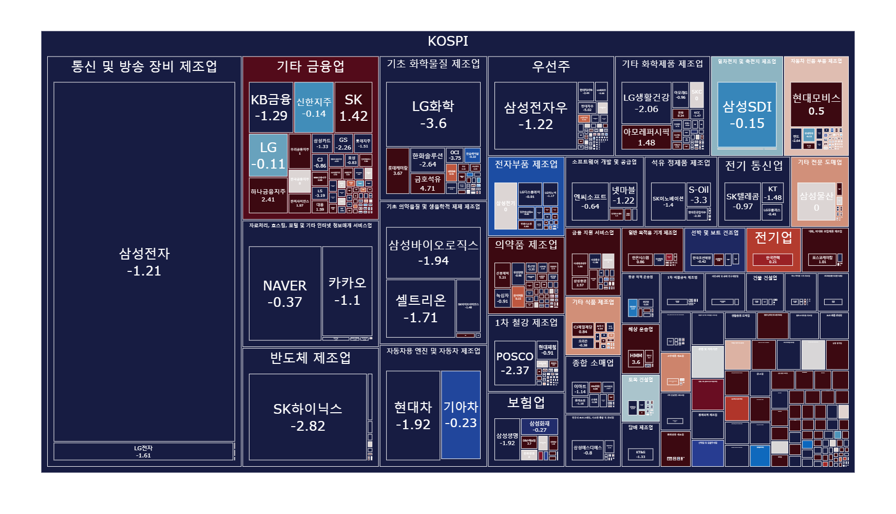
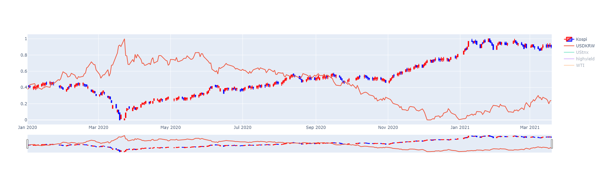
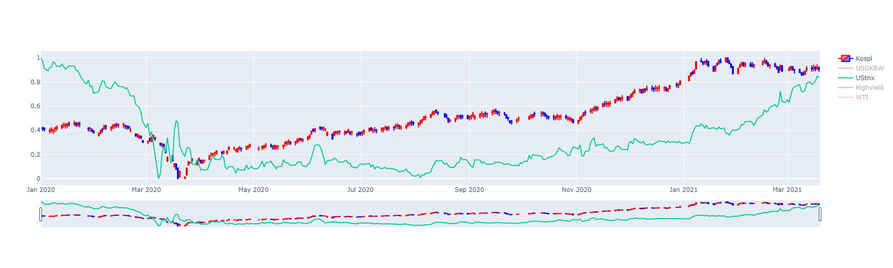
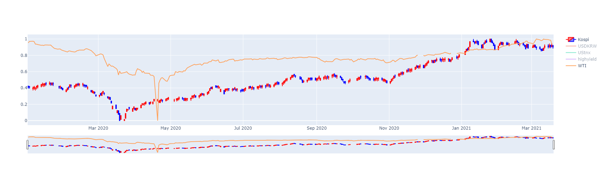
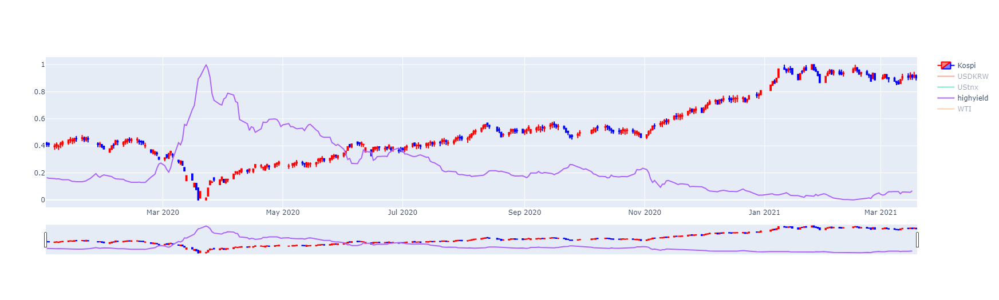

# Quant_Project (solo) - From. 2021_03_19 ~

> # 개요
> * 퀀트란 무엇일까???
> > Quantitative 와 Analyst의 합성어로, 수학 및 통계에 기반해 투자 모델을 만들거나 금융 시장 변화를 예측하는 사람을 말합니다.
> * 무엇을 예측하는가 ?
> > 진행할 프로젝트는 대한민국의 대표 주식 시장 지수인 KOSPI 지수를 다양한 ML/DL 방식을 이용하여 예측하고자 합니다.
---
> # 1. 한국 시장 특성 이해하기
> > ## 사용 코드 
> > * Link: [Google colab](https://colab.research.google.com/drive/1Gw9PhsBfbKKa3j3-4I4woP3iLPXT09Zx#scrollTo=18OZP0qU0iQy)
> > * Link: [GitHub](https://github.com/wjdqlsdlsp/Quant_Project-Solo--/blob/main/Kospi_Analysis.ipynb)
> > ## 사용 데이터셋
> > * 주식종목 데이터: [KRX](http://data.krx.co.kr/contents/MDC/MDI/mdiLoader/index.cmd?menuId=MDC0201020101)
> > * FinanceData : [FinanceData](https://github.com/FinanceData/FinanceDataReader)
> > * High Yield index : [Fred](https://fred.stlouisfed.org/series/BAMLH0A0HYM2EY) 
> > * WTI _ Crude Oil Price : [Yahoo Finance](https://finance.yahoo.com/quote/CL=F?p=CL=F&.tsrc=fin-srch) 
> > ## 1) 코스피 업종 분포
> > 
> > 2021년 3월 19일 기준, KOSPI 업종의 등락표입니다. 주로, 반도체, 화학, 금융, 자동차, 인터넷 등과 같은 주도주들이 코스피의 등락을 결정하고 있습니다. 따라서, 이러한 업종의 상황에 따라서, 코스피의 등락이 결정되므로, 모델을 만들 때, 고려해야 한다고 판단됩니다.
> > ## 2) 코스피의 영향을 끼치는 지수들
> > ## 2-1) 원/달러 환율
> > 
> > 코스피에 가장 큰 영향을 끼치는 항목을 고르라면, 원/달러 환율을 뽑고 싶습니다. 보시는 그래프와 같이, 달러가 강할 때, 코스피 지수가 낮게 형성되고, 반대로 달러가 약할 때, 코스피가 높게 형성 됨을 알 수 있습니다. 이는 외국인 자본의 영향으로 인해 발생하는 현상입니다.
> > ## 2-2) 미국 채권 지수
> > 
> > 미국 채권 지수는, 전세계에 큰 영향을 끼치는 항목입니다. 특히 대한민국과 같이 강하게 성장하고 있는 국가일 수록 큰 영향을 끼치는 지수 입니다.
> > ## 2-3) 국제 유가 WTI
> > 
> > 국제 유가를 포함한 다양한 원자재 또한, 지수에 영향을 끼치는 항목 중 하나입니다.
> > ## 2-4) High Yield 지수
> > 
> > 탄광 속 카나리아라고 불리는 항목입니다. 정크펀드 등의 상황을 말해주는 지수로, 하이일드 스프레드가 높게 형성 될 경우, 코스피의 상황이 안좋고, 낮게 형성 될 경우, 코스피의 상황이 좋게 흘러갑니다.
> >   이처럼 다양한 항목이 주가의 영향을 끼치므로, 분석 및 모델을 설계할 때 다양한 항목에 대해서 고려해야 합니다.
